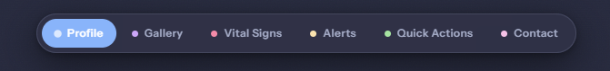
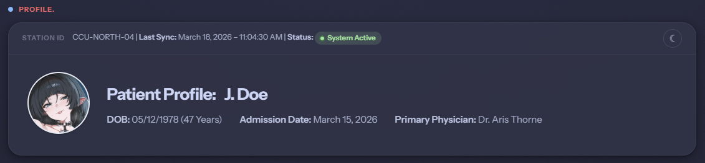
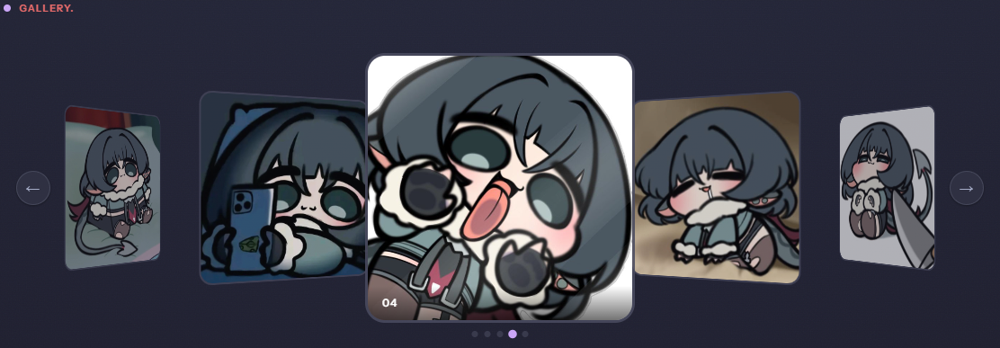
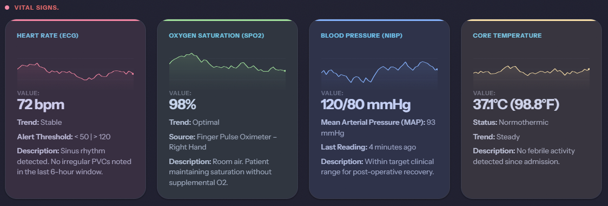
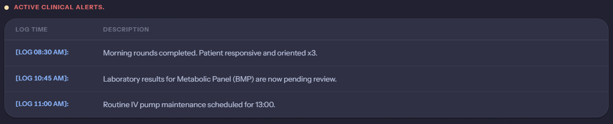
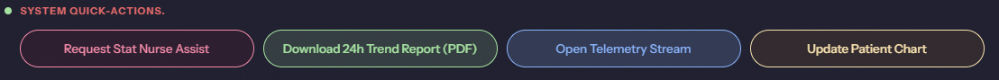
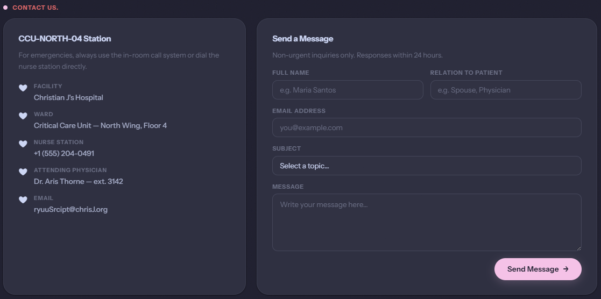
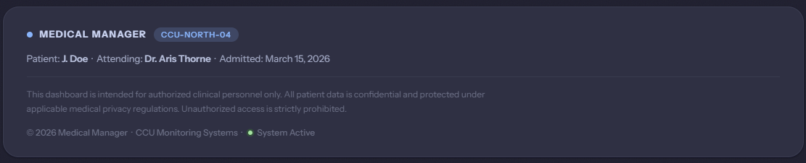

<div align="center">



# 𖹭 Medical Manager
### Patient Monitoring Dashboard — CCU-NORTH-04


*A fully client-side clinical monitoring dashboard built with vanilla HTML, CSS, and JavaScript. Designed with the Catppuccin color palette, glassmorphism UI, and smooth interactive animations.*

</div>

---

## 𖹭 Full Preview

<div align="center">

</div>

---

## 𖹭 Features

### 𖹭 Smart Navigation Bar


- Fixed pill-shaped nav bar with **color-coded section indicators**
- **Smooth scroll** to each section on click
- **Focus & dim system** — clicking a section highlights it and fades all others
- Toggle focus off by clicking the active section again
- Active dot auto-updates based on scroll position via `IntersectionObserver`

---

### 𖹭 Patient Profile


- Displays patient photo, name, DOB, admission date, and attending physician
- Live **Station ID bar** showing last sync time and system status
- Animated **System Active** badge with pulsing green indicator
- Built-in **light/dark mode toggle** (☀︎ / ☾) persisted via `localStorage`

---

### 𖹭 3D Image Gallery


- **3D carousel** with `perspective` and `rotateY` CSS transforms
- Smooth spring-eased transitions between slides (`cubic-bezier(0.34, 1.56, 0.64, 1)`)
- Infinite scroll with **previous / next buttons**, **dot indicators**, and **swipe/drag** support
- Side cards are clickable to jump directly to that slide
- Auto-advances every 4 seconds — pauses on user interaction

---

### 𖹭 Vital Signs Monitor


- Four live **sparkline charts** rendered on `<canvas>` for:
  - ❤️ Heart Rate (ECG)
  - 🟢 Oxygen Saturation (SpO2)
  - 🔵 Blood Pressure (NIBP)
  - 🟡 Core Temperature
- Charts animate in with a **wave-sweep effect** on page load
- Color-coded per vital using Catppuccin accent tokens
- Randomized data generation with mean-reversion noise simulation

---

### 𖹭 Active Clinical Alerts


- Timestamped **activity log table** for clinical events
- Clean tabular layout with subtle hover highlights
- Accessible with proper `<time>` elements and `aria-label` attributes

---

### 𖹭 System Quick-Actions


- Four action buttons with **unique accent colors** per action type
- Each button triggers a **popup modal** with contextual information:
  - 𖹭 Request Stat Nurse Assist
  - 𖹭 Download 24h Trend Report
  - 𖹭 Open Telemetry Stream
  - 𖹭 Update Patient Chart
- Modal supports keyboard (`Escape`) and backdrop-click to dismiss

---

### 𖹭 Contact Us


- Two-column layout: **contact info panel** + **message form**
- Form fields: Full Name, Relation to Patient, Email, Subject (dropdown), Message
- Custom-styled `<select>` with minimal SVG chevron (no native browser arrow)
- **Client-side validation** with error modal for missing required fields
- On successful send: **clears all form fields** and shows a confirmation modal
- Pink (`#ea76cb` Catppuccin Latte Pink) accent throughout

---

### 𖹭 Footer


- Glassmorphism card matching the overall aesthetic
- Displays patient summary, legal disclaimer, and system status
- Animated **System Active** dot reusing the same pulse keyframe as the profile badge

---

## 𖹭 Design System

| Token | Light (Latte) | Dark (Mocha) |
|---|---|---|
| Background | `#f0eeff` | `#1e1e2e` |
| Card | `rgba(235,231,255,0.72)` | `rgba(49,50,68,0.85)` |
| Text Primary | `#4c4f69` | `#cdd6f4` |
| Accent Blue | `#1e66f5` | `#89b4fa` |
| Accent Red | `#d20f39` | `#f38ba8` |
| Accent Green | `#40a02b` | `#a6e3a1` |
| Accent Amber | `#df8e1d` | `#f9e2af` |
| Accent Mauve | `#8839ef` | `#cba6f7` |
| Accent Pink | `#ea76cb` | `#f5c2e7` |

> Palette: [Catppuccin](https://github.com/catppuccin/catppuccin) — Latte (light) & Mocha (dark)  
> Font: [Instrument Sans](https://fonts.google.com/specimen/Instrument+Sans) via Google Fonts

---

## 𖹭 Sound Design

| Event | File |
|---|---|
| Element hover | `tingog/hover.flac` |
| Element click | `tingog/click.mp3` |
| Quick action / modal open | `tingog/quick_action.mp3` |

All sounds are throttled, cloned per-play, and wrapped in `.catch(() => {})` to silently handle autoplay restrictions.

---

## 𖹭 Project Structure

```
𖹭 project/
├── main.html              # Main page structure
├── main.css               # All styles & design tokens
├── main.js                # All interactive behavior
├── img/
│   ├── patient_photo.jpg  # Patient profile photo
│   ├── jane1.jpg          # Gallery images
│   ├── jane2.jpg
│   ├── jane3.jpg
│   ├── jane4.jpg
│   └── jane5.jpg
├── tingog/
│   ├── hover.flac         # Hover sound
│   ├── click.mp3          # Click sound
│   └── quick_action.mp3   # Action/modal sound
└── WebScreenshots/        # README preview images
```

---

## 𖹭 Getting Started

No build tools or dependencies required. Just open the file:

```bash
# Clone the repo
git clone https://github.com/yourusername/medical-manager.git

# Open in browser
open main.html
```

> 𖹭 Sound effects require a local server or user interaction to play due to browser autoplay policies. Use [Live Server](https://marketplace.visualstudio.com/items?itemName=ritwickdey.LiveServer) in VS Code for best results.

---

## 𖹭 Accessibility

- Semantic HTML5 elements (`<main>`, `<section>`, `<article>`, `<nav>`, `<footer>`, `<time>`)
- `aria-label`, `aria-labelledby`, `aria-live`, `aria-hidden` throughout
- Keyboard navigable modals with focus management
- `sr-only` utility class for screen-reader-only headings
- Respects `prefers-color-scheme` via manual toggle with `localStorage` persistence

---

<div align="center">

© 2026 Medical Manager &nbsp;·&nbsp; CCU Monitoring Systems &nbsp;·&nbsp; 🟢 System Active

</div>